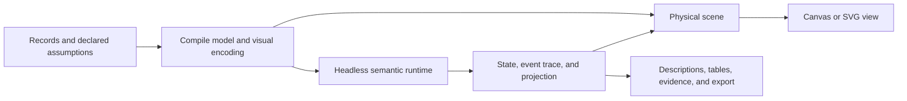

# Physics visualization review

Reviewed September 8, 2026, against `1bfc66f5b` (`3.9.2`). This is a proposal and evidence record; it does not change library behavior.

**Make the offering about mechanisms that people can inspect.** Semiotic can make waiting, blocking, accumulation, dependency, transformation, and feedback visible while keeping the underlying records and results available. That is a compelling direction. The next cycle should consolidate correctness, execution, and presentation around a few excellent examples.

The strongest existing foundations are the retained frame/store split, fixed-step kernel, optional engine adapters, source identity, region observations, capacity controllers, shared selection, encoding compiler, static rendering, and explicit event tapes. Crucible's authored lineage and ChainReaction's distinction between prerequisite delivery and task completion are particularly useful semantic models. Keep these investments.

The central weakness is that the contracts are stronger in prose than in execution. A settled body is not necessarily a completed process; a counted body is not necessarily a correctly placed datum; a deterministic kernel does not automatically make a browser-driven process deterministic. The review found concrete examples of all three.

**State what physics is allowed to determine.**

The existing “When Physics?” guide distinguishes layout, process, uncertainty, and texture. Add a second distinction about who determines the answer:

| Job | What is authoritative | What physics may change | Required static reading |
| --- | --- | --- | --- |
| Arrange data | Supplied values and categories | Unencoded positions, collision spacing | Exact positions on encoded axes, counts, source records |
| Explain recorded or authored events | An ordered event log or pure transformation | Travel, emphasis, staging, explanatory motion | State at a chosen event/time, transitions, reasons, lineage |
| Explore a declared model | Model rules, assumptions, inputs, and recorded run | Outcomes explicitly assigned to the model | Run results, assumptions, trace, sensitivity, and limits |

These are descriptions of behavior, not three new components. A workflow may use all three, but each claim needs an owner. “Illustrative model” should appear beside a simulated outcome; “observed” should identify source measurements. A draggable barrier that alters the model is a different control from a speed slider that changes presentation.

Revise the universal requirement that a terminal answer must exist without simulation. An inspectable result and trace can be generated by a bounded simulation. That allows emergent models to remain first-class. Pure terminal reducers are an excellent requirement for authored event tapes. The broad prohibition currently conflicts with the Stakeholder Journey example and with Gauntlet's default trajectory-dependent crash outcome. See [the terminal resolver's stated limitation](src/components/charts/physics/gauntletTerminal.ts) and [the reference's terminal-state guidance](ai/reference.md).

**Fix the following before expanding the portfolio.**

The numerical findings below use source builders and the current built-in engine. Browser findings use the source docs application in headless Chromium. They are observed results; the recommended fixes remain proposals.

| Priority | Finding and evidence | Proposed change and acceptance criterion |
| --- | --- | --- |
| P1 | **Collision swarms distort the encoded axis.** With 50 records all equal to 50, `xExtent: [0, 100]`, radius 8, seed 1, and size 700×360, the settled layout displaces a point by 60.07 px, equivalent to 9.95 data units. All 50 bodies sleep; the ledger balances and emits no warning. The spring attracts toward both x and y while collisions move both coordinates. | Make quantitative-axis preservation a hard constraint. Resolve overlaps on the free axis; handle insufficient space explicitly. Test repeated values, close neighbors, extremes, multiple lanes, and resizing. A datum at 50 must remain at the x-coordinate for 50. [Builder](src/components/charts/physics/collisionSwarmPhysics.ts), [description claim](src/components/ai/describeChart.ts). |
| P1 | **Unitization changes with row partitioning and loses exact totals.** One category with values `[49, 49]` and `unitValue: 100` produces zero bodies and projection value 0. `[98]` produces one body and projection value 1. `[51, 51]` produces two; `[102]` produces one. The builder rounds each record separately, and the overlay reports the rounded body count. | Retain exact source totals independently of tokens. Define aggregation, remainder allocation, represented amount, and overflow behavior. If rows themselves are the countable entities, expose that as an explicit alternative. Equivalent category totals must survive row splitting; display “98 total; one token represents 100” with an honest fractional/remainder treatment. Audit HOC, server, descriptions, recommendations, and sediment together. [Builder](src/components/charts/physics/physicsPilePhysics.ts), [overlay](src/components/charts/physics/physicsProjectionOverlays.tsx), [exact-total capability claim](src/components/charts/physics/UnitPileChart.capability.ts). |
| P1 | **EventDrop uses a final watermark to classify historical events.** For event times `[0, 10, 20]`, arrivals `[0, 10, 20]`, windows of 10, and delay 5, the first event is tagged late. Reversing arrivals leaves every late flag unchanged. `arrivalAccessor` controls pacing; classification uses `windowEnd <= watermarkValue` with one watermark for the whole input. | Define whether this is a current admission-policy snapshot or a replay of historical acceptance. For replay, classify each event against the watermark at its arrival and preserve that decision after its window closes. Test ordered arrivals, out-of-order arrivals, ties, corrections, and watermark advances against an independent event-time model. [Builder](src/components/charts/physics/eventDropPhysics.ts), [watermarks example](docs/src/pages/examples/WatermarksExamplePage.jsx). |
| P1 | **Reduced motion misses the result in important examples.** The captured Merge Pressure view shows 0 review visits and 0 merged points; the running view reaches 5 visits and 9 merged points. Stakeholder Journey's reduced view shows zero stage crossings; its running view reaches 21 First Impact, 18 Commitment, and 17 Leadership at the sampled time. These running samples are not terminal benchmarks. | Define a horizon or terminal condition for each model, then obtain its result through the same semantic execution path. Verify actual page ledgers across animated, reduced-motion, and server paths. Trace the current bounded settle/post-tick path and page callbacks before assigning a root cause. Increasing the iteration cap alone is insufficient. [Reduced-motion execution](src/components/stream/physics/physicsRegionRuntime.ts), [Merge Pressure](docs/src/pages/examples/MergePressureExamplePage.jsx), [Stakeholder Journey](docs/src/pages/examples/StakeholderJourneyExamplePage.jsx). |
| P1 | **The Release Machine's “Preview resolution” action crashes the page.** The button changes `ChartContainer.status` to `"preview"`; the container supports live/stale/paused/error/static and reads `STATUS_COLORS[status].bg` without a matching entry. Chromium displays the route error boundary. | Give preview an intentional, supported presentation and test the complete preview/clear-preview interaction. Review other dynamic status consumers and make an invalid presentation status fail gracefully. This JSX example escaped the TypeScript prop constraint. [Caller](docs/src/pages/examples/ChainReactionExamplePage.jsx), [container](src/components/ChartContainer.tsx). |
| P1 | **Spawn timing depends on render cadence.** With fixed dt 1/120, a body admitted at 0.25 seconds under gravity 100 reaches y=28.4375 after one second with 120/60 Hz ticks, y=29.7083 at 30 Hz, and y=32.3333 with 0.1-second ticks. The probe permits all required substeps, so this is not caused by the catch-up limit. | Admit scheduled events and run semantic transitions at fixed substep/event boundaries. Separate model time, presentation time, and numerical stepping. Compare the same event stream at different frame schedules, during pause/resume, and through a headless run. [Pipeline tick](src/components/stream/physics/PhysicsPipelineStore.ts). |
| P2 | **Galton's name and some descriptions promise an apparatus that is absent.** The builder assigns the final bin before spawning and confines bodies with tall bin walls. Mechanical samples are generated by Bernoulli draws before the physical run. There are no pegs in this builder, although its HOC JSDoc says samples drop through seeded pegs. | Describe the current component as a distribution drop, preserving the existing export. Make generated samples explicit. If a Galton demonstration is retained, visibly enact its branch decisions or implement a declared mechanical model with measured bin outcomes. Preserve supplied samples when explaining observed distributions. [Builder](src/components/charts/physics/galtonBoardPhysics.ts), [HOC](src/components/charts/physics/GaltonBoardChart.tsx). |

A related evidence gap makes these defects easy to miss. For the 50-point swarm, `renderChartWithEvidence` returns `status: "ok"`, 50 marks, no warnings, and `semanticStatus: "not-assessed"`. It correctly reports rendering, but has no axis-preservation check. `diagnoseConfig` warns about constant values but misses displacement. For the zero-body pile, rendering reports emptiness while diagnostics return no findings. Both descriptions say “No settled projection is loaded yet,” even though supplied data is enough to derive the relevant reading.

The 100-point swarm probe also exhausts the default 1,200-step settle limit with only two bodies sleeping. `buildPhysicsSettledEvidence` returns `settled: false` and an empty warnings list. Propagate completion and limit-exhaustion status explicitly. Keep “not assessed,” “incomplete,” and “verified” distinct in agents and UI.

**Consolidate execution around a semantic model and a recorded run.**

Build on the existing encoding compiler, controllers, event tapes, projection helpers, and Artifact Contract. Start with one mechanism, such as an event-time window or capacity queue, before generalizing.

For an explicitly physical model, contact and region observations feed the semantic runtime under declared rules. Record the run so every rendering surface can inspect the same outcome. For authored replay, outcome decisions already exist in the event tape. Keep this distinction visible in the compiled plan.

Useful consolidation targets:

- Move model transitions and continuous forces into a shared stepping boundary. Currently controllers and forces run after a whole pipeline tick; reduced motion batches settle passes; raw server rendering primarily settles the kernel. A common headless executor would make these paths comparable.
- Separate execution status from presentation status: current domain time, paused playback, physical rest, process completion, and step-budget exhaustion are different facts. Keep existing public controls compatible while defining shared reset, replay, seek/next-event, and snapshot semantics.
- Give each high-level chart a typed projection with units, source IDs, represented quantity, and outcome provenance. The existing `{label, value, secondary}` rows and integer body ledger are insufficient for all unitization, merge/split, absorption, and workflow outcomes.
- Reconcile declared and observed quantities and locations. Check identity accounting, exact totals, valid destinations, encoded-axis displacement, unfinished arrivals, duplicate transitions, and model completion. A body-count balance alone cannot establish correctness. Reuse domain-specific ledgers where they already exist.
- Keep authored geometry in model/world coordinates. Viewport size, label layout, color, and presentation speed should leave the semantic answer invariant for replay and nonspatial models. If space is a model parameter, declare it separately from the viewport.
- Resolve defaults and compile layouts once for browser and server consumers. Source defaults have already diverged: Galton's primary HOC radius defaults to 6 while its server builder falls back to 4; UnitPile uses 8 versus 5; EventDrop uses 7 versus 5. Also audit domain and simulation-mode forwarding when consolidating these paths. [Server builders](src/components/server/serverChartConfigsPhysics.ts).
- Preserve the built-in engine and optional adapters while defining a tested operating envelope. The worker path currently rejects runtime region effects, body forces, and controllers, so its scaling story does not yet cover the richest process examples. Portable built-in controller definitions are a more useful first investment than another engine integration.

**Make the visual language easier to read.**

The existing examples contain good material, but the first useful reading often competes with implementation panels and dense apparatus. Treat chart typography, spatial organization, and motion choreography as shared library behavior.

| Surface reviewed | Specific observation | Design direction |
| --- | --- | --- |
| Galton and UnitPile docs | The chart contract panel says no projection is loaded; the rendered chart sits beneath configuration and audit prose. Galton's normalized frequency line and physical pile heights use different vertical mappings. | Lead with an actual question and its chart. Derive the explanatory sentence from the compiled projection. Align the physical and statistical reading, or put the exact distribution in a clearly separate strip. Show numeric bin intervals. |
| Watermarks | At 390 px the title overlaps the explanation, window labels collide, and important scene content reaches the clipped edge. Desktop exposes many competing metrics and a session log before the main reading. | Start with a few events and windows, one clear boundary, and one selected event's decision. Reveal the broader log on demand. On mobile show fewer windows with deliberate navigation and put the legend/title outside the apparatus. |
| Release Machine | Five lanes, crossing delivery paths, tilted completed blocks, and truncated titles become hard to distinguish on mobile. | Default to the selected blocker and its immediate dependencies, with an explicit expansion to affected work. Keep a full graph for exploration. Use stable label anchors and a compact impact summary. |
| Rhetorical Crucible | The editorial page has a distinctive visual identity; the embedded apparatus uses pale labels and white titles on the light paper background. Important outlet text is tiny. | Let the chart adopt the host's palette and type hierarchy through shared tokens. Keep phase, entity, product, and outlet distinguishable without relying on the prose below it. |
| Merge Pressure and Stakeholder Journey | The mechanisms are meaningful, but a still of starting bodies and zero counters does not communicate the promised result. | Provide an immediate meaningful snapshot and a short guided replay. Show the baseline and changed condition at a common declared horizon. Include exact result differences and a path for inspecting one entity. |

Use a common audience-facing sequence: **what one mark represents → what rule acts on it → what changed → the exact result**. Keep source and model assumptions close enough to inspect. Put implementation diagnostics, full prop lists, and general production guidance after the explanation or behind developer controls.

For motion, use stable spatial anchors, a quiet neutral apparatus, restrained semantic color, and emphasis on meaningful events. Keep labels still when bodies move. Provide pause, replay, next meaningful event, and show-result controls where applicable. Reduced motion should retain the reasoning through discrete states, selected paths, and readable outcomes.

The appearance/dynamics distinction also needs refinement: `compilePhysicsEncoding` uses `appearance.size` as collision radius by default. Size and shape can therefore change congestion and outcomes. Expose whether collision geometry follows visible geometry, and require that coupling to be intentional in a model. Scale quantitative area appropriately instead of silently treating arbitrary magnitudes as radii.

**Give developers and AIs the same short path to a correct chart.**

The public entry point already offers substantial capability. Reduce the amount someone must understand at once: task-oriented chart examples first, reusable mechanism recipes second, frame/kernel APIs third. Preserve existing names and aliases while improving their descriptions and discovery.

Extend the existing specs and behavior contracts with the facts an author or agent must know: what a body represents, which fields own outcomes, which channels are quantitative, the clock and units, projection derivation, and what each control is permitted to change. Generate the React example, serialized example where supported, description, and verification task from the same specification.

`describeChart` currently searches several optional projection-shaped properties rather than deriving a physics reading from the supplied chart data. Feed descriptions and audits the compiled projection directly. Do not require an agent to invent extra component props to make its chart describable. See [the projection lookup](src/components/ai/describeChart.ts).

Improve chart suggestions around intent. A numeric column is not enough reason to suggest a physical swarm, and a category/value table is not enough reason to suggest unit piles. Ask whether the user is explaining accumulation, tracing a rule, or comparing a modeled intervention. Keep ordinary chart alternatives available for precise comparison.

Add focused generation and interpretation tasks: create an ordered-arrival replay with zero late events; explain why a particular event was rejected; preserve totals under fractional unitization; identify the highest-impact blocker; distinguish an authored result from a simulated result; produce a usable static chart. Evaluate semantic correctness and repair behavior, not just successful rendering or prop validity. Schema checks alone cannot establish that an AI or a human understands the picture.

**Concentrate the showcase on three existing experiences.**

1. **Watermarks:** the clearest rule demonstration once historical acceptance is correct. Show why the same event is admitted or rejected under a declared policy.
2. **Merge Pressure:** the strongest opportunity to show capacity, waiting, and rework. Compare two conditions with the same inputs and horizon; retain the service ledger and quantitative summary.
3. **Release Machine:** dependency consequences and a reversible intervention. Repair preview, simplify the first view, and make the newly available work unmistakable.

Use UnitPile as the introductory accumulation example after its exact-value contract is repaired. Keep Crucible, Stakeholder Journey, and the encoding/frame labs as advanced examples. Their richer metaphors benefit from an audience that already understands the basic reading protocol. Each flagship should have a small runnable example before its full narrative page.

**Demonstrate usefulness with task evidence.**

Physics visualization has substantial precedent. D3 supplies force simulation and Vega exposes a force transform; the opportunity is a cohesive visualization workflow around mechanisms, semantics, inspection, and accessible output. This is a positioning inference from their documented surfaces, not an exhaustive claim about every competing library. [D3 force documentation](https://d3js.org/d3-force), [Vega force transform](https://vega.github.io/vega/docs/transforms/force/).

Research supports a task-specific case. Kim, Correll, and Heer found that staged aggregate animations improved identification of aggregate operations, sometimes at a time cost. Robertson and colleagues found animation enjoyable but weaker for the trend-analysis tasks they studied. These studies motivate testing explanatory understanding and intervention prediction alongside accuracy and speed; they do not establish that Semiotic's current physics charts are effective. [Animated aggregate operations](https://idl.uw.edu/papers/animated-aggregate-operations), [animation in trend visualization](https://www.microsoft.com/en-us/research/publication/effectiveness-of-animation-in-trend-visualization/).

For each flagship, compare the same data and explanation in an ordinary static chart, a discrete stepped explanation, and the physics version. Measure whether people can identify the rule, explain a particular outcome, predict the effect of a changed input, and retrieve an exact value. Counterbalance order, hold wording and controls comparable, and include reduced-motion and mobile conditions. Run developer and AI tasks separately. Engagement is useful evidence; comprehension and correct transfer to a new case are the stronger proof of this offering's value.

**Implement in this order.**

| Stage | Concrete result | Exit condition |
| --- | --- | --- |
| 1. Correct the claims | Repair axis preservation, unitization, event-time semantics, preview, and result availability; align affected docs/specs. | Focused regression cases pass through relevant HOC, server, description, and browser paths. Record the related-surface audit for each defect. |
| 2. Unify one mechanism's execution | Use one headless semantic executor and recorded result for a queue or event-window model. | Same inputs and horizon produce equivalent semantic outcomes across cadence, replay, reduced motion, and export. Limits report incomplete status explicitly. |
| 3. Polish three flagships | Shared typography, apparatus, controls, responsive layouts, and a short reading protocol. | A first-time reader can identify the entity, rule, and result; keyboard and mobile tasks remain possible; no action crashes. Validate this with people rather than relying only on snapshots. |
| 4. Make authoring reproducible | Task-based recipes, compiled descriptions, schema-backed examples, and semantic evaluation cases. | Developers and AIs can build and explain the mechanisms with the supported public APIs and receive useful feedback when they get them wrong. |

**Verification performed and limits.**

- `npx vitest run src/components/stream/physics/PhysicsKernel.test.ts src/components/stream/physics/PhysicsEngineConformance.test.ts src/components/stream/physics/PhysicsEvidence.test.ts src/components/charts/physics/PhysicsTerminalState.test.tsx src/components/charts/physics/PhysicsReducedMotion.test.tsx src/components/charts/physics/PhysicsCharts.server.test.tsx src/components/charts/physics/physicsEncoding.test.ts`: **7 files, 41 tests passed**.
- `npx vitest run src/components/stream/physics src/components/charts/physics src/components/recipes/physics`: **55 files, 412 tests passed**. This overlaps the first run; counts are not additive.
- Source-level probes measured swarm displacement, row-partition effects on unitization, arrival-order classification, render-cadence differences, and server/description/diagnostic output. These are exploratory reproductions, not committed regression tests.
- Chromium inspected Galton, UnitPile, CollisionSwarm, ProcessFlow, StreamPhysicsFrame, Physics Encoding, Watermarks, Release Machine, Merge Pressure, Stakeholder Journey, and Rhetorical Crucible. Selected routes were inspected with motion enabled and at 390 px under reduced motion. Preview resolution reproduced the documented crash; late-event injection completed without a page error.
- The existing preview on port 3000 had stale optimized dependencies. An isolated source preview on 3011 resolved that infrastructure issue. `/examples/data-viz-for-dummies-6` could not be visually assessed: the initial readiness wait and a separate screenshot attempt timed out. Root cause remains unresolved.
- This review did not run the release suite, a production website build, real optional-engine packages, hardware performance benchmarks, screen-reader sessions, or a user/AI comprehension study. Existing conformance tests passing do not substitute for those validations.

Review captures and the exploratory scripts are available locally in `/private/tmp/semiotic-physics-review/`, `/private/tmp/semiotic-physics-review-browser.cjs`, and `/private/tmp/semiotic-physics-review-probes.ts`. Findings are open; no defect is represented as fixed by this review.

## Implementation follow-through and new findings

Started September 8, 2026, from `175555198` on `codex/physics-correctness`. The review above records the original findings; this section records subsequent changes and verification.

**First repair batch.**

| Finding | Change and audit result |
| --- | --- |
| Release Machine preview crash | The example uses the supported `static` container status and an explicit preview subtitle. Unsupported runtime status strings retain a readable neutral badge instead of crashing the chart. The control bar now uses the host theme's surface color, fixing its pale-on-pale preview caption in dark mode. Searched other dynamic status consumers; this was the only `preview` caller. Client rendering, React server rendering, and the full browser preview/clear interaction are covered. |
| UnitPile loses or invents quantity | Labels now sum nonnegative source values, independently of body count. Full circles carry `unitValue`; each record's remainder uses a circle with proportional area. Body data retains source fields plus `representedValue`, `unitValue`, and `unitFraction`. Values 49 + 49 and 98 both report 98 and represent the same total circle area with `unitValue=100`; 51 + 51 and 102 both represent 102. Zero, negative, and nonfinite values add no quantity or bodies. Floating-point quotients do not create spurious slivers. Builder, HOC, React SSR, `renderChartWithEvidence`, and imperative push/update/remove quantity paths are covered. Live layout/projection synchronization remains open below. |
| UnitPile's related imperative defects | Removed the fallback full-size body previously created for zero/invalid pushes. Fixed anonymous row/body ID tracking so an initial row expanded into multiple bodies can be removed. Tests cover partial pushes, zero pushes, updates from 49 to 102, and removal of live and queued units. |
| Cadence-dependent spawn timing | Live ticks and synchronous settling now use the same fixed-step execution loop. An arrival is admitted at a step boundary after the preceding interval has run, so it receives no motion from before birth. The gravity probe now yields y=28.4375 at 120, 60, 30, and 10 Hz when the substep budget permits one model second. Tests also compare observed/unobserved settling and worker messages, snapshot/restore with fractional display time, pause, exact arrival boundaries, and invalid display deltas. |
| Browser/server defaults and forwarding | Server builders now match primary circle radii for Galton (6), UnitPile (8), and EventDrop (7). Galton also matches compact-mode radii. Both no-data generators honor `simulationMode` alongside display `mode`, and serialized Galton rendering preserves supplied `valueExtent`. Focused server tests cover these cases; existing alias/export tests pass. No export was renamed or removed. |
| Silent incomplete evidence | A scene that fails the existing strict settled check now reports `PHYSICS_NOT_SETTLED`; public server rendering propagates the warning. This does not claim semantic correctness or distinguish every reason for incompleteness. The new server regression deliberately exhausts a two-step budget while a body is still falling. |
| Incorrect Galton apparatus claim | Removed the HOC description of simulated peg collisions. Its documentation now states that values enter preassigned bins and mechanical samples are generated before physical replay. The existing export is preserved. |

**UnitPile design decision.** The initial review suggested aggregating before token allocation. This batch instead preserves per-record provenance with exact partial units: combining records would make a single body belong to several independently removable/selectable source rows. Body count can therefore change when rows are repartitioned, while represented quantity and total circle area remain invariant. The guide is explicitly approximate; exact labels are the quantitative reading. This is a deliberate revision to the proposed allocation strategy, not a claim that body count or pile height now encodes an exact total. The chart spec, generated schema, capability descriptions, documentation page, and AI example explain this contract. `valueAccessor`'s documented default was also corrected: omitted means one per input row in sample mode; mechanical mode defaults to `value`.

**New findings and unfinished related work.**

1. **Live projection and geometry synchronization needs a separate repair.** UnitPile's imperative path unitizes an isolated row, while category tubes and projection rows come from the declarative layout. Pushes therefore do not refresh source-total labels or establish the full category geometry. The same isolated-row builder pattern appears in Galton and CollisionSwarm. `StreamPhysicsFrame` consumes `initialSpawns` when creating its store; changing a HOC layout without remounting does not itself replace that initial scene. Audit data replacement, accessor/unit changes, new categories, update/remove/clear, and reruns together. The quantity regressions above do not close this lifecycle finding.
2. **Unitization changes the budget contract.** Keeping source identity means every positive record can contribute a partial circle, even when `unitValue` is very large. Increasing `unitValue` alone cannot guarantee a bounded body count. The AI example no longer promises that it can. The body-count ledger still does not reconcile represented quantity or quantities retired into sediment; a quantitative ledger remains necessary.
3. **Catch-up limits previously advanced arrivals beyond executed physics.** Model elapsed time now advances only for fixed steps actually run. Under overload, bounded catch-up can slow model progress relative to wall time. The cadence equivalence tests explicitly allow the required substeps; they do not promise equal results at equal wall time after discarded work. Controller callbacks still run after a display tick/settle batch, so controller-driven processes are not yet cadence-independent.
4. **Quiescence and strict settled evidence disagree.** The pipeline can report rest after sustained low speed while bodies remain formally awake. The existing evidence predicate requires every body to sleep. The new warning exposes that disagreement rather than silently accepting it. A later execution-status design should distinguish physical quiescence, sleeping, semantic completion, and exhausted budget.
5. **Preview caption contrast was a theme mismatch.** The Release Machine mixed a permanently light paper color into the control bar but used the active theme's text color. The surface-token correction was inspected in both themes; the broader mobile label/route congestion from the review remains open.
6. **Radius drift also reached the documentation tables.** Galton, UnitPile, and EventDrop pages stated the old server defaults (4, 5, and 5). Their tables now match the browser defaults and corrected server builders (6, 8, and 7); Galton's compact exceptions and UnitPile's partial-circle sizing are stated explicitly.

Next correctness work: hard quantitative-axis preservation for CollisionSwarm; historical event admission for EventDrop/Watermarks; the live layout/projection lifecycle above; and a shared controller executor for reduced motion and static results. Data-derived AI descriptions and the three larger visual redesigns also remain open. No first-batch result should be read as closing those findings.

**Verification for this batch.**

- Physics, recipe, static chrome, and container regression run: **59 files, 447 tests passed**. Follow-up tests for the final worker clock and server configuration/evidence cases: **3 files, 28 tests passed**; these overlap the broader run.
- Chromium preview/clear regression: **4 tests passed**, covering 1280 px and 390 px viewports in light and dark themes. Source-page inspection also opened UnitPile and Release Machine with no page errors. Captures are in `/private/tmp/semiotic-physics-fixes-browser-results/` and `/private/tmp/semiotic-physics-review/`.
- `npm run typescript` and `npm run typescript:tests` passed with no errors. Targeted ESLint and `npm run check:custom-lints` passed.
- `npm run check:chart-specs`, `check:ai-schema`, `check:ai-contracts`, `check:ai-reference-coverage`, `check:ai-examples-coverage`, `check:agent-skill`, `check:context7`, `check:llms`, `check:capabilities`, and `check:docs-prop-tables` passed. Ran the owning schema generator.
- `npm run check:website-build` passed, including the production library/declaration build, AI instruction check, API/description generation, documentation prerendering, route checks, asset budgets, and protected documentation boundaries. A final `check:website-build:from-dist` passed after the radius-table corrections; its first sandboxed attempt hit a `tsx` IPC permission error, and the approved rerun completed successfully.
- Related container description/data-audit and MCP HOC-rendering tests: **3 files, 16 tests passed**. Closing focused regressions: **4 files, 30 tests passed** (overlapping earlier runs). File-size and docs-playground checks, final diff review, and whitespace checks passed. Full release testing, real optional-engine packages, screen readers, and a comprehension study are outside this first batch.

## Second repair batch: live source updates and exact swarm axes

Continued from `699745a68` on September 8, 2026.

| Finding | Change and related-surface audit |
| --- | --- |
| Bodies and projection labels disagree after edits | GaltonBoardChart, UnitPileChart, and CollisionSwarmChart now share a source-record model. Push/update/remove/clear, replacement data, accessors, unit values, categories, bins, and radius changes compile through the same full-data builders. New categories get their own geometry; inferred domains incorporate every current source row. Data controls no longer require changing React keys. Tests cover all three HOCs and the PhysicsPileChart alias. |
| Updates restart or lose the wrong parts of a scene | Reconciliation retains the clock, motion of bodies whose placement is unchanged, and frame-authored colliders. Changed placement is rebuilt. Declarative replacement preserves arrival pacing; imperative pushes remain immediate, including while paused. New `data` arrays are authoritative. Ordinary rerenders preserve live edits; an enabled `rerunMS` deliberately restores the original seed. Portable snapshots carry changes to worker execution. |
| Unstable source identity | The browser and server builders share anonymous ID allocation, reserving authored IDs before assigning fallbacks, including mixed anonymous/authored push batches. Matching IDs upsert a source record. Renaming an updated record cannot leave duplicate source totals behind. The older bridge's prefix matcher now respects an explicit datum ID, so removing `row` does not accidentally remove `row-extra`. |
| Swarm changes the quantitative position it claims to preserve | Bodies now support optional `fixedPosition: { x?, y? }`. The built-in kernel holds those coordinates through forces, impulses, contacts, queued admission, state reads, and snapshot/worker restore. Collisions separate along the remaining free axis. CollisionSwarmChart fixes x to the data scale and uses vertical targets within each group lane. Tests measure zero x displacement during and after motion, including repeated identical values. |
| Too many equal-valued points cannot fit in a lane | A deterministic packing pass keeps radius and x unchanged. When that packing cannot fit, the lane retains every point using a disclosed overlap fallback, with a visible notice and an accessible lane description. The count stays explicit. Radius and height controls let readers make room. Builder, React SSR, serialized server rendering/evidence, sync, worker, and browser paths are covered. |
| Zero-time synchronization advances model time | A worker restore/acknowledgement called `tick(0)`, which could consume a whole step left by a prior catch-up limit. Zero/invalid deltas now refresh without consuming accumulated time. Snapshot restore also emits actual simulation-state changes, preventing a previously scheduled replay from interrupting newly pushed rows. |
| Docs conceal update defects | Removed forced remounts from the pile, Galton, and swarm examples. Added a live pile editor with source rows and a checkable total, plus an equal-value swarm preset, radius/height controls, and responsive chart width. AI contracts, chart specs, generated schema, reference text, capability guidance, and the low-level frame guide explain the new behavior. |

**New findings and design limits.**

1. Source rows and physical bodies need distinct readback. For the three repaired charts, `getData()` returns each source record once, including records still queued; `getCustomLayout()` exposes the live/queued body snapshot. Existing arrival-pacing and reduced-motion tests were strengthened to inspect bodies and queues, so source readback cannot make a broken animation test pass. `popBodies` is still a visual operation; use `remove` to edit source records and totals. A later re-encoding or seeded replay can recreate a visually popped source record.
2. Crowding is a real encoding tradeoff. A fixed x position, fixed radius, finite lane height, and zero overlap cannot always coexist. The fallback preserves x and radius and discloses overlap. The greedy packing pass is not a proof that no alternative arrangement could fit; improving packing efficiency remains possible. Vertical position is spacing, not a second quantitative field.
3. Fixed coordinates take precedence over incompatible forces and contacts. This is an additive built-in body contract; third-party engine adapters must implement it themselves. The supplied Matter/Rapier migration helpers do not establish custom-adapter conformance.
4. Initial spawn pacing is part of the experience. Rebuilding every changed body as an immediate arrival would make data controls dump a whole pile into one position. Declarative changes now preserve pacing. Reflow can restart bodies whose encoding changes; preserving every trajectory across a changing domain is not promised.
5. The source-model migration is intentionally scoped to Galton, UnitPile, and CollisionSwarm. EventDrop's historical admission rules and the flow/custom charts' process semantics still need their own lifecycle audit and migration. The shared prefix-match and zero-time fixes cover those underlying helpers without claiming their projections are repaired.
6. The mechanical-input AI contract incorrectly included CollisionSwarmChart, which has no mechanical mode. Its scope now names only Galton and UnitPile. The capability checker also needed to recognize the new source-model handle bridge; its tests verify an actual call and imperative implementation.
7. The physics SVG fallback imported the entire XY scene dispatcher to draw only circles and rectangles. Shared point/rectangle serializers now let physics avoid retaining unrelated path renderers. The implementation is shared with XY, preserving hatch fills, opacity, and cursor behavior; serializer and server parity regressions cover the extraction. Kernel snapshot cloning was also extracted to keep the large kernel file from growing.
8. The AI reference still described Galton as Plinko-like and listed UnitPile's sample `valueAccessor` default as "value". The reference and its generated mirror now explain preassigned Galton bins, generated Bernoulli samples, row counting when UnitPile's accessor is omitted, and partial circles. Galton's chart spec and generated schema now use the same apparatus description. The new source hook also follows the existing isomorphic-effect convention for server rendering.
9. Packaging remains open. Against a clean build of the starting commit in the same environment, the physics import shrank from **167.8 to 163.4 KiB gzip**, but the broad AI graph grew from **579.6 to 581.6 KiB**. The final AI graph exceeds its unchanged 580 KiB limit by **1,597 bytes**, and geo exceeds its unchanged 113 KiB limit by **56 bytes**. Artifact and the combined multi-subpath consumer pass. These are introduced size-gate failures, not baseline failures; resolve them before merging without raising the limits.

**Where to try the changes.** Start `npm run docs:dev` and use its printed localhost URL. The working preview for this batch uses port **3011**.

| Route | Interaction and expected result |
| --- | --- |
| `/charts/unit-pile-chart#live-updates` | The editor starts at **49 + 49 = 98**. **Add 49 to A** makes **147**; **Add category B** makes a second tube and a combined total of **247**. Change **Value per full circle** from 100 to 50: the number/size of circles changes, while A stays 147 and B stays 100. Try double, remove, clear, reset, and **Pause motion**. The source table makes the arithmetic inspectable. |
| `/charts/collision-swarm-chart#example` | Click **Test equal values**. All 50 points stay on **x=50**, with an overlap notice at radius 8 and height 340. Set **Point radius** to **2**, or **Chart height** to **900**, to fit the points and clear the notice. Switch distribution, lanes, and variable radius to test updates on the existing chart. |
| `/charts/galton-board-chart#example` | Select **Mechanical** and change branch probability, generated count, or peg rows. Bodies, bins, and projection change without a chart-key reset. This remains a replay of pre-generated values entering assigned bins, not a simulation of peg collisions. |
| `/frames/physics-frame#fixed-coordinates` | Read the new low-level `fixedPosition` contract for custom scenes. |

**Second-batch verification.**

- `npx vitest run src/components/charts/physics src/components/stream/physics src/components/recipes/physics.test.ts src/components/server/staticFrameChromeParity.test.tsx src/components/stream/SceneToSVG.test.tsx`: **60 files / 489 tests passed**. Final serializer checks passed **4 files / 80 tests**, and source-model/server follow-ups passed **2 files / 17 tests**; these overlap the broader run.
- Browser suite: **12 Chromium cases passed**, covering 1280 px and 390 px in light/dark themes. Separate motion-enabled Galton/swarm inspections reported no page/console errors. Captures remain in `/private/tmp/semiotic-physics-fixes-browser-results/` and `/private/tmp/semiotic-physics-review/`.
- Source/test TypeScript, targeted ESLint, custom lints, file-size checks, and the public API surface check passed. The API snapshot adds only the fixed-coordinate fields and overlap metadata described above.
- Chart-spec/schema, AI contracts/instructions/reference/examples, agent-skill, Context7, LLM mirrors, capabilities, capability-checker tests, prop tables, and playground checks passed. Ran the owning generators for changed artifacts.
- Production library build, full website build, and the closing `check:website-build:from-dist` passed, including route and documentation asset/boundary checks. `npm run size` **fails** for AI and geo as quantified above; the separately run combined-import check passes at **384.8 / 386 KiB**. No size or coverage limit was raised.
- `npm run check:pack` passed across all public package exports, including TypeScript consumers, worker entry points, and packed physics example rendering. Its initial sandboxed install hit registry `ENOTFOUND` errors; that attempt was interrupted and the approved rerun passed. Final diff and whitespace review passed.
- Full release testing, real optional-engine packages, screen readers, hardware benchmarks, and a comprehension study were not run in this batch.

Remaining correctness priorities: historical EventDrop/Watermarks admission; a shared controller executor that makes reduced-motion/static results semantically complete; source-derived AI descriptions; and quantity-aware completion/sediment ledgers. The larger example redesigns and audience-comprehension work remain open.
