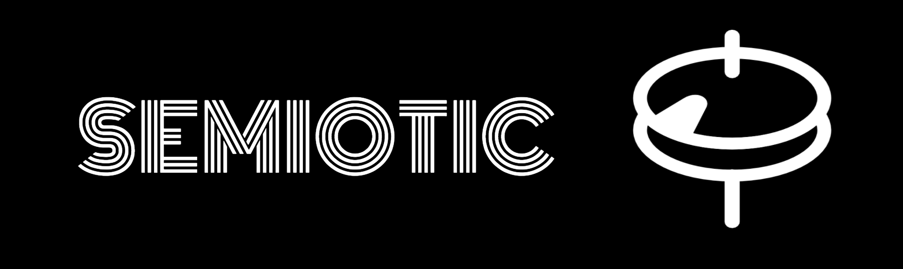

[](https://github.com/emeeks/semiotic/wiki/)

[](https://circleci.com/gh/emeeks/semiotic/tree/master)

Semiotic is a data visualization framework combining React &amp; D3

[Interactive Documentation](https://emeeks.github.io/semiotic/)

[API Docs on the wiki](https://github.com/emeeks/semiotic/wiki)

[Examples](https://github.com/emeeks/semiotic-examples)

Installation

```
npm i semiotic
```

Example

```js
import { XYFrame } from "semiotic"
```

You can also use the static distribution:

```
https://unpkg.com/semiotic/dist/semiotic.min.js
```

In which case the elements are exposed as properties of a `Semiotic` object:

```js
const { XYFrame } = Semiotic
```

This is how it's used in [these Codepen examples](https://codepen.io/emeeks/).

_Semiotic icon based on an icon by André Schauer_

It may not be apparent in the commit logs but development of this library owes a lot to:

* Susie Lu
* Jason Reid
* James Womack
* Matt Herman
* Shelby Sturgis
* Tristan Reid


Using BrowserStack for browser compatibility testing

[](http://browserstack.com/) 
