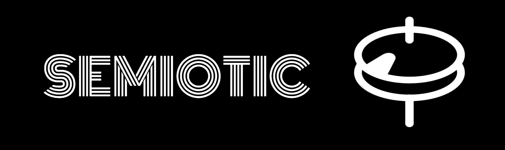

[](https://semiotic.nteract.io)

[](https://github.com/nteract/semiotic/actions/workflows/node.js.yml)
[](https://www.npmjs.com/package/semiotic)
[](https://www.typescriptlang.org/)

A React data visualization library designed for AI-assisted development.

Simple charts in 5 lines. Network graphs, streaming data, and coordinated
dashboards when you need them. Structured schemas and an MCP server so
AI coding assistants generate correct chart code on the first try.

```jsx
import { LineChart } from "semiotic"

<LineChart
  data={salesData}
  xAccessor="month"
  yAccessor="revenue"
/>
```

## Why Semiotic

Semiotic is a data visualization library for React that combines broad chart
coverage with first-class AI tooling. It handles the chart types that most
libraries skip — network graphs, streaming data, statistical distributions,
coordinated views — and ships with machine-readable schemas so LLMs can
generate correct code without examples.

### Built for AI-assisted development

Semiotic ships with everything an AI coding assistant needs to generate
correct visualizations without trial and error:

- **`semiotic/ai`** — a single import with all 28 chart components, optimized for LLM code generation
- **`ai/schema.json`** — machine-readable prop schemas for every component
- **`npx semiotic-mcp`** — an MCP server for tool-based chart rendering in any MCP client
- **`npx semiotic-ai --doctor`** — validate component + props JSON from the command line
- **`CLAUDE.md`** — instruction files auto-synced for Claude, Cursor, Copilot, Windsurf, and Cline
- **`llms.txt`** — machine-readable documentation following the emerging standard

Every chart includes a built-in error boundary and dev-mode validation
warnings with typo suggestions, so AI-generated code fails gracefully with
actionable diagnostics instead of a blank screen.

### Beyond standard charts

**Network visualization.** Force-directed graphs, Sankey diagrams, chord
diagrams, tree layouts, treemaps, circle packing, and orbit diagrams — all
as React components with the same prop API as LineChart.

**Streaming data.** Realtime charts render on canvas at 60fps with a
ref-based push API. Built-in decay, pulse, and staleness encoding for
monitoring dashboards.

**Coordinated views.** `LinkedCharts` provides hover cross-highlighting,
brush cross-filtering, and selection synchronization across any combination
of chart types — zero wiring.

**Statistical summaries.** Box plots, violin plots, swarm plots, histograms,
LOESS smoothing, forecast with confidence envelopes, and anomaly detection.
Marginal distribution graphics on scatterplot axes with a single prop.

### Start simple, go deep

| Layer | For | Example |
|---|---|---|
| **Charts** | Common visualizations with sensible defaults | `<LineChart data={d} xAccessor="x" yAccessor="y" />` |
| **Frames** | Full control over rendering, interaction, and layout | `<StreamXYFrame chartType="line" lineStyle={...} />` |

Every Chart component accepts a `frameProps` prop to access the underlying
Frame API without leaving the simpler interface.

### Serialization and interop

Charts serialize to JSON and back: `toConfig`, `fromConfig`, `toURL`,
`copyConfig`, `configToJSX`. Have Vega-Lite specs? `fromVegaLite(spec)`
translates them to Semiotic configs — works with `configToJSX()` for
full round-trip from notebooks and AI-generated specs.

### When to use something else

Need a standard bar or line chart for a dashboard you'll never need to
customize beyond colors and labels? [Recharts](https://recharts.org) has a
larger ecosystem and more community examples. Need GPU-accelerated rendering
for millions of data points? [Apache ECharts](https://echarts.apache.org)
handles that scale.

Semiotic is for projects that outgrow those libraries — when you need
network graphs alongside time series, streaming data alongside static
snapshots, or coordinated views across chart types.

## Install

```bash
npm install semiotic@3.0.0
```

Requires React 18.1+ or React 19.

## Quick Examples

### Coordinated Dashboard

Hover one chart, highlight the same data in another — zero wiring:

```jsx
import { LinkedCharts, Scatterplot, BarChart } from "semiotic"

<LinkedCharts>
  <Scatterplot
    data={data} xAccessor="age" yAccessor="income" colorBy="region"
    linkedHover={{ name: "hl", fields: ["region"] }}
    selection={{ name: "hl" }}
  />
  <BarChart
    data={summary} categoryAccessor="region" valueAccessor="total"
    selection={{ name: "hl" }}
  />
</LinkedCharts>
```

### Streaming Metrics with Decay

Live data fades old points, flashes new ones, flags stale feeds:

```jsx
import { RealtimeLineChart } from "semiotic"

const chartRef = useRef()
chartRef.current.push({ time: Date.now(), value: cpuLoad })

<RealtimeLineChart
  ref={chartRef}
  timeAccessor="time"
  valueAccessor="value"
  decay={{ type: "exponential", halfLife: 100 }}
  staleness={{ threshold: 5000, showBadge: true }}
/>
```

### Network Graphs

Force-directed graphs and Sankey diagrams — same API as LineChart:

```jsx
import { ForceDirectedGraph, SankeyDiagram } from "semiotic"

<ForceDirectedGraph
  nodes={people} edges={friendships}
  colorBy="team" nodeSize={8} showLabels
/>

<SankeyDiagram
  edges={budgetFlows}
  sourceAccessor="from" targetAccessor="to" valueAccessor="amount"
/>
```

### Streaming System Monitor

Live service topology with threshold alerting and click-to-inspect:

```jsx
import { StreamNetworkFrame, ChartContainer, DetailsPanel, LinkedCharts } from "semiotic"

const chartRef = useRef()
chartRef.current.push({ source: "API", target: "Orders", value: 15 })

<LinkedCharts>
  <ChartContainer title="System Monitor" status="live"
    detailsPanel={
      <DetailsPanel position="right" trigger="click">
        {(datum) => <div>{datum.id}: {datum.value} req/s</div>}
      </DetailsPanel>
    }>
    <StreamNetworkFrame ref={chartRef} chartType="sankey"
      showParticles particleStyle={{ proportionalSpeed: true }}
      thresholds={{ metric: n => n.value, warning: 100, critical: 250 }}
    />
  </ChartContainer>
</LinkedCharts>
```

### Standard Charts

Line, bar, scatter, area — all the basics, with sensible defaults:

```jsx
import { LineChart, BarChart } from "semiotic"

<LineChart
  data={salesData}
  xAccessor="month" yAccessor="revenue"
  curve="monotoneX" showPoints
/>

<BarChart
  data={categoryData}
  categoryAccessor="department" valueAccessor="sales"
  orientation="horizontal" colorBy="region"
/>
```

## All Chart Components

| Category | Components |
|---|---|
| **XY** | `LineChart` `AreaChart` `StackedAreaChart` `Scatterplot` `ConnectedScatterplot` `BubbleChart` `Heatmap` |
| **Categorical** | `BarChart` `StackedBarChart` `GroupedBarChart` `SwarmPlot` `BoxPlot` `Histogram` `ViolinPlot` `DotPlot` `PieChart` `DonutChart` |
| **Network** | `ForceDirectedGraph` `ChordDiagram` `SankeyDiagram` `TreeDiagram` `Treemap` `CirclePack` `OrbitDiagram` |
| **Realtime** | `RealtimeLineChart` `RealtimeHistogram` `RealtimeSwarmChart` `RealtimeWaterfallChart` `RealtimeHeatmap` |
| **Coordination** | `LinkedCharts` `ScatterplotMatrix` |
| **Layout** | `ChartGrid` `ContextLayout` `CategoryColorProvider` |
| **Frames** | `StreamXYFrame` `StreamOrdinalFrame` `StreamNetworkFrame` |

### Vega-Lite Translation

Paste a Vega-Lite spec, get a Semiotic chart:

```jsx
import { fromVegaLite } from "semiotic/data"
import { configToJSX, fromConfig } from "semiotic"

const config = fromVegaLite({
  mark: "bar",
  data: { values: [{ a: "A", b: 28 }, { a: "B", b: 55 }] },
  encoding: {
    x: { field: "a", type: "nominal" },
    y: { field: "b", type: "quantitative" },
  },
})

// Render directly
const { componentName, props } = fromConfig(config)
// → componentName: "BarChart", props: { data, categoryAccessor: "a", valueAccessor: "b" }

// Or generate JSX code
configToJSX(config)
// → <BarChart data={[...]} categoryAccessor="a" valueAccessor="b" />
```

Supports bar, line, area, point, rect, arc, tick marks with encoding translation
for color, size, aggregation, and binning.

## Smaller Bundles

Import only what you need:

```jsx
import { LineChart } from "semiotic/xy"                 // 123 KB
import { BarChart } from "semiotic/ordinal"              // 118 KB
import { ForceDirectedGraph } from "semiotic/network"    // 127 KB
import { LineChart } from "semiotic/ai"                  // HOC-only surface for AI generation
```

Granular entry points export only v3 Stream Frames and HOC charts — no legacy
utilities or backwards-compatibility shims.

## TypeScript

Built with `strict: true`. Full type definitions ship with the package.
Generics for type-safe accessors:

```tsx
interface Sale { month: number; revenue: number }

<LineChart<Sale>
  data={sales}
  xAccessor="month"    // TS validates this is keyof Sale
  yAccessor="revenue"
/>
```

## Server-Side Rendering

Static SVG generation for Node.js (email, OG images, PDF):

```js
import { renderToStaticSVG } from "semiotic/server"

const svg = renderToStaticSVG("xy", {
  lines: [{ coordinates: data }],
  xAccessor: "date",
  yAccessor: "value",
  size: [600, 400],
})
```

Works with Next.js App Router, Remix, and Astro via `"use client"` directives.

## Documentation

[Interactive docs and examples](https://semiotic.nteract.io)

- [Getting Started](https://semiotic.nteract.io/getting-started)
- [Charts](https://semiotic.nteract.io/charts) — all 27 chart types with live examples
- [Frames](https://semiotic.nteract.io/frames) — full Frame API reference
- [Features](https://semiotic.nteract.io/features) — axes, annotations, tooltips, styling, Vega-Lite translator
- [Cookbook](https://semiotic.nteract.io/cookbook) — advanced patterns and recipes
- [Playground](https://semiotic.nteract.io/playground) — interactive prop exploration

## Upgrading

- [Migration Guide](./MIGRATION.md) — upgrading from v1.x or v2.x
- [Changelog](./CHANGELOG.md) — full release history

## Contributing

See [CONTRIBUTING.md](CONTRIBUTING.md). Our community follows the nteract
[Code of Conduct](https://github.com/nteract/nteract/blob/main/CODE_OF_CONDUCT.md).

## Acknowledgments

Development of this library owes a lot to Susie Lu, Jason Reid, James Womack,
Matt Herman, Shelby Sturgis, and Tristan Reid.

The Sankey layout engine is based on [sankey-plus](https://github.com/tomshanley/sankey-plus)
by [Tom Shanley](https://github.com/tomshanley), which improved on his earlier
`d3-sankey-circular` with better cycle detection, hierarchical arc stacking,
and dynamic extent adjustment.

_Semiotic icon based on an icon by Andre Schauer._

## License

[Apache 2.0](./LICENSE)
