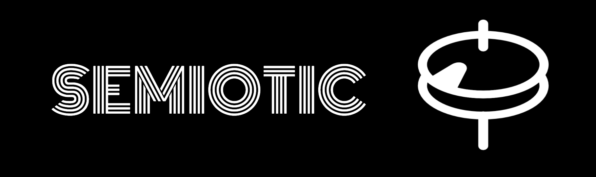
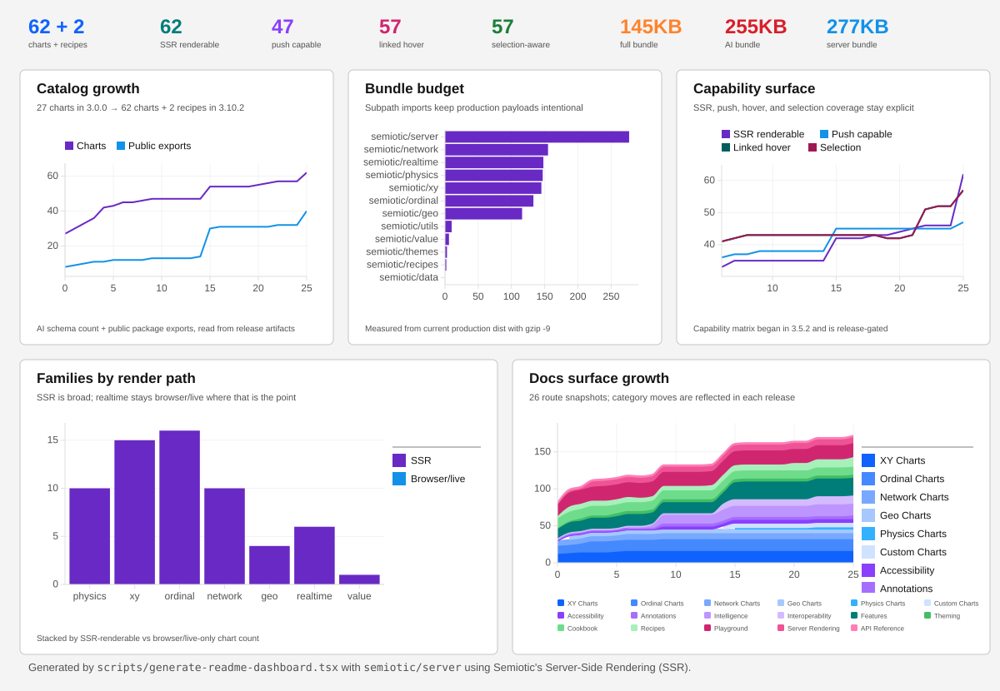

[](https://mcptoplist.com/server/io.github.nteract%2Fsemiotic)

[](https://semiotic.nteract.io)

[](https://github.com/nteract/semiotic/actions/workflows/node.js.yml)
[](https://www.npmjs.com/package/semiotic)
[](https://www.typescriptlang.org/)
[](https://mseep.ai/app/nteract-semiotic)

A React data visualization library designed for AI-assisted development.

Simple charts in 5 lines. Network graphs, streaming data, and coordinated
dashboards when you need them. Structured schemas and an MCP server so
AI coding assistants generate correct chart code on the first try.

<!-- semiotic-readme-dashboard:start -->

<!-- semiotic-readme-dashboard:end -->

## What's New in 3.9.2

3.9.2 expands Semiotic's portable chart, accessibility, evidence, and rendering
surfaces while tightening browser/server parity and production entry graphs:

- `LineChart` gains the dedicated `semiotic/line` entry, and chart HOCs,
  network layouts, force workers, and optional overlays load only the runtime
  code their chart paths need.
- `ChartAccessContract@1`, `ChartEvidenceEnvelope@1`, and the new
  `semiotic/access` and `semiotic/evidence` entries provide schema-backed access
  inventories, privacy-aware provenance, deterministic hashing, MCP evidence
  fragments, and publication gates.
- `ParallelCoordinatesRecipe` and `CalendarHeatmapRecipe` are now portable,
  JSON-safe chart recipes, while Minimap, ScatterplotMatrix, and ChainReaction
  gain evidence-backed static rendering through `semiotic/server` and MCP.
- Typed realtime handles preserve authored row types, `styleRules` now spans
  ordinal, XY, network, geo, realtime, and physics families, and structured
  navigation provides overview-first hierarchy and choropleth semantics.
- Renderer and interaction fixes cover constant-value heatmaps, linked
  selection and hover, automatic network legends, Waterfall and Radar geometry,
  marginal graphics, custom layouts, tree-shaken network registration, and
  instance-local accessible names.
- Release evidence now includes controlled dense-browser measurements,
  deterministic linked-hover cohorts, generated bundle guidance, stronger AI
  diagnostics, and stricter shipped-product and contributor gates.

## Why Semiotic

Semiotic is a data visualization library for React that combines broad chart
coverage with first-class AI tooling. It handles the chart types that most
libraries skip — network graphs, streaming data, statistical distributions,
coordinated views — and ships with machine-readable schemas so LLMs can
generate correct code without examples.

### Built for AI-assisted development

Semiotic ships with everything an AI coding assistant needs to generate
correct visualizations without trial and error:

- **`semiotic/ai`** — a single import with the schema-backed chart capability catalog (XY, ordinal, network, realtime, geo, value, and portable recipes), optimized for LLM code generation. See `ai/surface-manifest.json` for the generated current inventory. Note: the published entry files are pre-bundled, so importing one chart from `semiotic/ai` still ships most of the bundle — treat it as a codegen/tooling surface and use family subpaths (`semiotic/xy`, `semiotic/geo`, `semiotic/value`, …) in production code, at roughly half the single-chart cost.
- **`ai/schema.json`** — machine-readable prop schemas for every component
- **`npx semiotic-mcp`** — an MCP server for tool-based chart rendering in any MCP client
- **`npx semiotic-ai --doctor`** — validate component + props JSON from the command line with typo suggestions and anti-pattern detection
- **`diagnoseConfig(component, props)`** — programmatic anti-pattern detector with actionable fixes, spanning validation, encoding, accessibility, and misleading-design (deception) checks
- **`auditData(component, props, data?)`** — chart-aware numeric preflight for inputs that pass schema validation but break the math: non-finite values, zero-span domains, invalid log inputs, negative size geometry, unsafe normalized totals, and scale-dominating outliers. Returns bounded row evidence and flows into `diagnoseConfig`, Chart Clinic, CLI doctor, and opt-in `ChartContainer` notifications
- **`AGENTS.md`** — concise repository workflow shared by modern coding agents;
  `CLAUDE.md` imports it and Copilot receives a short compatibility bridge
- **`ai/reference.md`** — complete on-demand product reference, kept out of
  always-loaded coding-agent context
- **`llms.txt`** — machine-readable documentation following the emerging standard

Every chart includes a built-in error boundary, dev-mode validation
warnings with typo suggestions, and accessibility features (canvas
`aria-label`, keyboard-navigable legends, `aria-live` tooltips, SVG
`<title>`/`<desc>`) so AI-generated code fails gracefully with
actionable diagnostics instead of a blank screen.

### Accessibility is a release surface

The [European Accessibility Act](https://eur-lex.europa.eu/legal-content/EN/TXT/?uri=legissum%3A4403933)
has applied to covered products and services since 28 June 2025. A chart
library cannot certify an application's legal compliance: scope, content,
surrounding controls, testing, and national enforcement remain the
application owner's responsibility. Semiotic supplies testable infrastructure
for that work: keyboard interaction, accessible data tables, layered
descriptions, structured navigation, reduced-motion and forced-colors paths,
and WCAG-derived contrast tests for shipped theme presets. See the
[Accessibility docs](https://semiotic.nteract.io/accessibility/overview) and
run the application's own assistive-technology and user testing.

### Beyond standard charts

**Network visualization.** Force-directed graphs, Sankey diagrams, chord
diagrams, tree layouts, treemaps, circle packing, and orbit diagrams — all
as React components with the same prop API as LineChart.

**Streaming data.** Realtime charts render on canvas at 60fps with a
ref-based push API. Rapid network edge pushes coalesce into one layout per
animation frame, while read/mutation methods preserve synchronous read-after-write
semantics. Built-in decay, pulse, and staleness encoding for monitoring dashboards.

**Coordinated views.** `LinkedCharts` provides hover cross-highlighting,
brush cross-filtering, coordinate-based linked crosshairs, and selection
synchronization across any combination of chart types through shared selection state.

**Geographic visualization.** Choropleth maps, proportional symbol maps, flow
maps with animated particles, and distance cartograms — all canvas-rendered
with d3-geo projections, zoom/pan, tile basemaps, and drag-rotate globe spinning.

**Statistical summaries.** Box plots, violin plots, swarm plots, histograms,
LOESS smoothing, forecast with confidence envelopes, and anomaly detection.
Marginal distribution graphics on scatterplot axes with a single prop.

**First-class annotations.** Annotations are data-bound objects, not post-hoc
artwork. Labels, callouts, thresholds, enclosures, statistical overlays, and
React widgets move with the chart and render through browser, SSR, and export
paths. Opt into placement, hierarchy, density, progressive disclosure,
audience-aware amount, provenance, and editorial lifecycle when the chart
needs to communicate more than its encoding alone.

### Choose the API layer

| Layer | For | Example |
|---|---|---|
| **Charts** | Common chart forms with chart-level props | `<LineChart data={d} xAccessor="x" yAccessor="y" />` |
| **Frames** | Full control over rendering, interaction, and layout | `<StreamXYFrame chartType="line" lineStyle={...} />` |

Chart HOCs register only the mark plugins they need. Direct `StreamXYFrame`
loads the remaining built-ins on first client paint. Call
`registerBuiltInXYPlugins()` from `semiotic/xy` or `semiotic/realtime/core`
before the first render when SSR or the first frame must include marks.

Every Chart component accepts a `frameProps` prop to access the underlying
Frame API without leaving the simpler interface.

### Serialization and interop

Charts serialize to JSON and back: `toConfig`, `fromConfig`, `toURL`,
`copyConfig`, `configToJSX`. Have Vega-Lite specs? `fromVegaLite(spec)`
translates them to Semiotic configs — works with `configToJSX()` for
full round-trip from notebooks and AI-generated specs.

Need an external pitfall review? The experimental `unstable_toDataPitfallsChain()` builds a
dependency-free chain input for [`datapitfalls`](https://github.com/bjonesdataliteracy/datapitfalls),
combining the Semiotic config, JSX, reader grounding, diagnostics,
accessibility audit, and optional rendered SVG/image evidence:

```ts
import { unstable_toDataPitfallsChain } from "semiotic/experimental"
import { detectPitfalls } from "datapitfalls"

const input = unstable_toDataPitfallsChain("LineChart", props, {
  narrative: "Monthly sales are accelerating.",
  rendered: { svg, evidence },
})

const report = await detectPitfalls(input, { apiKey: process.env.ANTHROPIC_API_KEY })
```

The return path stays dependency-free too. Use whole-chart findings as
`ChartContainer` notifications, and only turn findings into annotations after
your app can anchor them to marks or semantic positions:

```tsx
import { ChartContainer } from "semiotic"
import { LineChart } from "semiotic/xy"
import {
  unstable_toDataPitfallsAnnotations,
  unstable_toDataPitfallsNotifications,
} from "semiotic/experimental"

const notifications = unstable_toDataPitfallsNotifications(report)
const annotations = unstable_toDataPitfallsAnnotations(report, {
  anchorFor: (finding) =>
    finding.ruleId === "truncated-axis" ? { x: 9, y: 9000 } : null,
})

<ChartContainer notifications={notifications}>
  <LineChart {...props} annotations={annotations} />
</ChartContainer>
```

### When to use something else

Need a standard bar or line chart for a dashboard you'll never need to
customize beyond colors and labels? [Recharts](https://recharts.org) has a
larger ecosystem and more community examples. Need GPU-accelerated rendering
for millions of data points? [Apache ECharts](https://echarts.apache.org)
handles that scale.

Semiotic is for projects that outgrow those libraries — when you need
network graphs alongside time series, streaming data alongside static
snapshots, or coordinated views across chart types.

## Install

```bash
npm install semiotic
```

Requires React 18.1+ or React 19.

## Quick Examples

### Coordinated Dashboard

Hover one chart and highlight the same data in another through a shared selection:

```jsx
import { LinkedCharts, Scatterplot, BarChart } from "semiotic"

<LinkedCharts>
  <Scatterplot
    data={data} xAccessor="age" yAccessor="income" colorBy="region"
    linkedHover={{ name: "hl", fields: ["region"] }}
    selection={{ name: "hl" }}
  />
  <BarChart
    data={summary} categoryAccessor="region" valueAccessor="total"
    selection={{ name: "hl" }}
  />
</LinkedCharts>
```

### Streaming Metrics with Decay

Live data fades old points, flashes new ones, flags stale feeds:

```jsx
import { RealtimeLineChart } from "semiotic"

const chartRef = useRef()
chartRef.current.push({ time: Date.now(), value: cpuLoad })

<RealtimeLineChart
  ref={chartRef}
  timeAccessor="time"
  valueAccessor="value"
  decay={{ type: "exponential", halfLife: 100 }}
  staleness={{ threshold: 5000, showBadge: true }}
/>
```

### Network Graphs

Force-directed graphs and Sankey diagrams — same API as LineChart:

```jsx
import { ForceDirectedGraph, SankeyDiagram } from "semiotic"

<ForceDirectedGraph
  nodes={people} edges={friendships}
  colorBy="team" nodeSize={8} showLabels
/>

<SankeyDiagram
  edges={budgetFlows}
  sourceAccessor="from" targetAccessor="to" valueAccessor="amount"
/>
```

### Geographic Visualization

Choropleth maps, flow maps, and distance cartograms with canvas rendering,
zoom/pan, tile basemaps, and animated particles:

```jsx
import { ChoroplethMap, FlowMap, DistanceCartogram } from "semiotic/geo"

<ChoroplethMap
  areas={geoJsonFeatures} valueAccessor="gdp"
  colorScheme="viridis" projection="equalEarth" zoomable tooltip
/>

<FlowMap
  nodes={airports} flows={routes} valueAccessor="passengers"
  showParticles particleStyle={{ color: "source", speedMultiplier: 1.5 }}
/>

<DistanceCartogram
  points={cities} center="rome" costAccessor="travelDays"
  showRings costLabel="days" lines={routes}
/>
```

### Streaming System Monitor

Live service topology with threshold alerting and click-to-inspect:

```jsx
import { StreamNetworkFrame, ChartContainer, DetailsPanel, LinkedCharts } from "semiotic"

const chartRef = useRef()
chartRef.current.push({ source: "API", target: "Orders", value: 15 })

<LinkedCharts>
  <ChartContainer title="System Monitor" status="live"
    detailsPanel={
      <DetailsPanel position="right" trigger="click">
        {(datum) => <div>{datum.id}: {datum.value} req/s</div>}
      </DetailsPanel>
    }>
    <StreamNetworkFrame ref={chartRef} chartType="sankey"
      showParticles particleStyle={{ proportionalSpeed: true }}
      thresholds={{ metric: n => n.value, warning: 100, critical: 250 }}
    />
  </ChartContainer>
</LinkedCharts>
```

### Standard Charts

Line, bar, scatter, and area charts share the same accessor-driven API:

```jsx
import { LineChart, BarChart } from "semiotic"

<LineChart
  data={salesData}
  xAccessor="month" yAccessor="revenue"
  curve="monotoneX" showPoints
/>

<BarChart
  data={categoryData}
  categoryAccessor="department" valueAccessor="sales"
  orientation="horizontal" colorBy="region"
/>
```

## All Chart Components

| Category | Components |
|---|---|
| **XY** | `LineChart` `AreaChart` `DifferenceChart` `StackedAreaChart` `Scatterplot` `ConnectedScatterplot` `BubbleChart` `Heatmap` `QuadrantChart` `MultiAxisLineChart` `MinimapChart` `CandlestickChart` `ScatterplotMatrix` |
| **Categorical** | `BarChart` `StackedBarChart` `GroupedBarChart` `LikertChart` `SwimlaneChart` `FunnelChart` `SwarmPlot` `BoxPlot` `Histogram` `ViolinPlot` `RidgelinePlot` `DotPlot` `PieChart` `DonutChart` `GaugeChart` |
| **Network** | `ForceDirectedGraph` `ChordDiagram` `SankeyDiagram` `ProcessSankey` `TreeDiagram` `Treemap` `CirclePack` `OrbitDiagram` |
| **Geo** | `ChoroplethMap` `ProportionalSymbolMap` `FlowMap` `DistanceCartogram` |
| **Realtime** | `RealtimeLineChart` `RealtimeHistogram` `RealtimeSwarmChart` `RealtimeWaterfallChart` `RealtimeHeatmap` |
| **Coordination** | `LinkedCharts` |
| **Layout** | `ChartGrid` `ContextLayout` `CategoryColorProvider` |
| **Frames** | `StreamXYFrame` `StreamOrdinalFrame` `StreamNetworkFrame` `StreamGeoFrame` |

### Vega-Lite Translation

Paste a Vega-Lite spec, get a Semiotic chart:

```jsx
import { fromVegaLite } from "semiotic/data"
import { configToJSX, fromConfig } from "semiotic"

const config = fromVegaLite({
  mark: "bar",
  data: { values: [{ a: "A", b: 28 }, { a: "B", b: 55 }] },
  encoding: {
    x: { field: "a", type: "nominal" },
    y: { field: "b", type: "quantitative" },
  },
})

// Render directly
const { componentName, props } = fromConfig(config)
// → componentName: "BarChart", props: { data, categoryAccessor: "a", valueAccessor: "b" }

// Or generate JSX code
configToJSX(config)
// → <BarChart data={[...]} categoryAccessor="a" valueAccessor="b" />
```

Supports bar, line, area, point, rect, arc, tick marks with encoding translation
for color, size, aggregation, and binning.

### Conversation Arc Telemetry

Capture and replay the path an AI-assisted chart session took:

```ts
import {
  createLocalStorageConversationArcSink,
  enableConversationArc,
  getConversationArcStore,
  loadConversationArc,
  registerConversationArcSink,
} from "semiotic/ai"

const sink = createLocalStorageConversationArcSink({ key: "my-app:arc" })
registerConversationArcSink(sink)
enableConversationArc({ sessionId: "session-abc" })

getConversationArcStore().record({ type: "chart-rendered", component: "LineChart" })
loadConversationArc(sink.load(), { enabled: false })
```

## Bundle Sizes

Semiotic ships 32 stable JavaScript entry points (31 subpaths plus the root). **Don't import from `"semiotic"` unless you need everything** — use the smallest sub-path that matches your charts or tooling.

The numbers below are **first-party artifact cost**: the gzip size of Semiotic's own code for each sub-path. They exclude React and other runtime dependencies, so they are not a prediction of a cold application bundle. Do not add artifact rows to estimate an app: dependency resolution and cross-import deduplication happen in the consumer bundler and are measured separately below.

<!-- semiotic-bundle-sizes:start -->
<!-- Auto-generated by `scripts/sync-bundle-sizes.mjs`. Edit dist/*, not this block. -->

| Entry Point | gzip | What's inside |
|---|---|---|
| `semiotic/access` | **35 KB** | Chart Access Contract factory and first-wave baseline contracts |
| `semiotic/evidence` | **50 KB** | Chart Evidence Envelope, deterministic hashing, and publication gate |
| `semiotic/line` | **135 KB** | LineChart only — one-chart micro boundary |
| `semiotic/xy` | **166 KB** | LineChart, AreaChart, Scatterplot, Heatmap, + 8 more XY charts |
| `semiotic/ordinal` | **130 KB** | BarChart, PieChart, BoxPlot, Histogram, + 11 more categorical charts |
| `semiotic/network` | **157 KB** | ForceDirectedGraph, SankeyDiagram, ProcessSankey, Treemap, + 4 more |
| `semiotic/geo` | **113 KB** | ChoroplethMap, FlowMap, DistanceCartogram, ProportionalSymbolMap |
| `semiotic/realtime` | **162 KB** | RealtimeLineChart, RealtimeHistogram, + 4 streaming charts |
| `semiotic/realtime/core` | **161 KB** | Streaming chart types, HOCs, and buffer helpers |
| `semiotic/realtime/react` | **1 KB** | Stream status and synced push hooks |
| `semiotic/server` | **216 KB** | renderChart, renderDashboard, renderToImage, renderToAnimatedGif |
| `semiotic/server/node` | **216 KB** | renderChart, renderDashboard, renderToImage, renderToAnimatedGif |
| `semiotic/server/edge` | **222 KB** | renderChart, renderChartWithEvidence, renderToStaticSVG, renderDashboard |
| `semiotic/utils` | **103 KB** | ThemeProvider, numeric/accessibility audits, serialization — no chart components |
| `semiotic/utils/core` | **95 KB** | Pure theme helpers, numeric/accessibility audits, and serialization |
| `semiotic/utils/react` | **7 KB** | ThemeProvider, useTheme, useReducedMotion, useHighContrast, useStreamStatus |
| `semiotic/recipes` | **100 KB** | Pure layout functions (waffle, marimekko, flextree, dagre, …) |
| `semiotic/recipes/core` | **92 KB** | Pure layout functions (waffle, marimekko, flextree, dagre, …) |
| `semiotic/recipes/react` | **8 KB** | Glyph and React layout-selection helpers |
| `semiotic/themes` | **12 KB** | Theme presets only (tufte, carbon, etc.) |
| `semiotic/themes/core` | **12 KB** | Theme presets and token helpers |
| `semiotic/themes/react` | **7 KB** | ThemeProvider/useTheme and hooks |
| `semiotic/data` | **4 KB** | bin, rollup, groupBy, pivot, fromVegaLite |
| `semiotic/value` | **6 KB** | BigNumber — focal-value KPI / scorecard (SingleValueFrame POC) |
| `semiotic/physics` | **168 KB** | GaltonBoardChart, EventDropChart, UnitPileChart, CollisionSwarmChart, PacketFlowChart, PhysicsCustomChart |
| `semiotic/physics/matter` | **1 KB** | Matter.js migration helpers + optional peer guard (no chart components) |
| `semiotic/physics/rapier` | **1 KB** | Rapier peer guard + adapter decision metadata (no chart components) |
| `semiotic/ai` | **553 KB** | All schema-backed charts + validation — optimized for LLM code generation |
| `semiotic/ai/core` | **101 KB** | suggestCharts, auditData, describeChart, repairChartConfig, tool adapters — no chart components |
| `semiotic/controls` | **11 KB** | DirectManipulationControl, CircularBrush, MobileStandardControls, auditVisualizationControls — no frame renderer |
| `semiotic/rough` | **3 KB** | Optional deterministic Rough.js paint backend — exact Semiotic geometry remains authoritative |
| `semiotic` | **360 KB** | Everything below (full bundle) |

<!-- semiotic-bundle-sizes:end -->

### Cold-consumer named imports

The table above is **first-party artifact cost**, not an application bundle. The generated table
below measures a different thing: a fresh consumer bundles one retained named import from a packed
`semiotic` tarball through the public export path. It includes Semiotic and its resolved runtime dependencies,
but externalizes React/React DOM and optional adapter peers that the host application owns. Each row
starts cold, so use it to compare one public import choice—not to add together an application's rows.
The checked machine-readable baseline is `benchmarks/setup/cold-consumer-imports.json`; refresh it
after a production build with `npm run docs:cold-consumer`.

<!-- semiotic-cold-consumer:start -->
<!-- Auto-generated by `scripts/measure-cold-consumer.mjs`. Do not edit by hand. -->

Method: fresh `npm pack --ignore-scripts` tarball → temporary consumer → minified/tree-shaken esbuild ESM bundle → gzip -9. React/React DOM and optional adapter peers are external; Semiotic and its resolved runtime dependencies are included.

| Public named import | Runtime | gzip cold-consumer bundle |
|---|---:|---:|
| `import { LineChart } from "semiotic"` | browser | **140.0 KiB** |
| `import { LineChart } from "semiotic/xy"` | browser | **140.4 KiB** |
| `import { LineChart } from "semiotic/line"` | browser | **140.3 KiB** |
| `import { BarChart } from "semiotic/ordinal"` | browser | **133.1 KiB** |
| `import { SankeyDiagram } from "semiotic/network"` | browser | **157.5 KiB** |
| `import { RealtimeLineChart } from "semiotic/realtime"` | browser | **141.0 KiB** |
| `import { RingBuffer } from "semiotic/realtime/core"` | browser | **0.7 KiB** |
| `import { useStreamStatus } from "semiotic/realtime/react"` | browser | **0.6 KiB** |
| `import { GaltonBoardChart } from "semiotic/physics"` | browser | **150.3 KiB** |
| `import { MATTER_PHYSICS_CAPABILITIES } from "semiotic/physics/matter"` | browser | **0.2 KiB** |
| `import { RAPIER_PHYSICS_CAPABILITIES } from "semiotic/physics/rapier"` | browser | **0.2 KiB** |
| `import { renderChart } from "semiotic/server"` | node | **263.4 KiB** |
| `import { generateFrameSVGs } from "semiotic/server/edge"` | node | **118.8 KiB** |
| `import { renderToImage } from "semiotic/server/node"` | node | **264.0 KiB** |
| `import { suggestCharts } from "semiotic/ai"` | browser | **253.5 KiB** |
| `import { suggestCharts } from "semiotic/ai/core"` | browser | **44.8 KiB** |
| `import { createChartAccessContract } from "semiotic/access"` | browser | **31.0 KiB** |
| `import { toEvidenceEnvelope } from "semiotic/evidence"` | browser | **40.1 KiB** |
| `import { bin } from "semiotic/data"` | browser | **0.4 KiB** |
| `import { ChoroplethMap } from "semiotic/geo"` | browser | **115.5 KiB** |
| `import { createRoughRenderMode } from "semiotic/rough"` | browser | **3.1 KiB** |
| `import { resolveThemePreset } from "semiotic/themes"` | browser | **2.6 KiB** |
| `import { resolveThemePreset } from "semiotic/themes/core"` | browser | **2.6 KiB** |
| `import { ThemeProvider } from "semiotic/themes/react"` | browser | **5.2 KiB** |
| `import { validateProps } from "semiotic/utils"` | browser | **9.2 KiB** |
| `import { smartTickFormat } from "semiotic/utils/core"` | browser | **6.9 KiB** |
| `import { useReducedMotion } from "semiotic/utils/react"` | browser | **2.4 KiB** |
| `import { waffleLayout } from "semiotic/recipes"` | browser | **1.7 KiB** |
| `import { waffleLayout } from "semiotic/recipes/core"` | browser | **1.7 KiB** |
| `import { Glyph } from "semiotic/recipes/react"` | browser | **0.8 KiB** |
| `import { BigNumber } from "semiotic/value"` | browser | **5.9 KiB** |
| `import { DirectManipulationControl } from "semiotic/controls"` | browser | **1.3 KiB** |

**Line-boundary interpretation:** the retained named import from `semiotic/line` emits 422.7 KiB raw versus 422.7 KiB from `semiotic/xy`; gzip differs by 0.1 KiB (0.1%). Tree-shaking converges both paths on the same LineChart implementation graph. Treat `semiotic/line` as a narrower API/direct-ESM artifact boundary, not an application-bundle saving. Do not add another per-chart entry until its packed named import beats the family path by both 10 KiB gzip and 7%.

<!-- semiotic-cold-consumer:end -->

**d3 packaging model:** Semiotic externalizes the twelve d3 modules it imports
and declares them as normal runtime dependencies. Consumers do not need to
install d3 packages manually; their bundler resolves, deduplicates, and
tree-shakes that dependency graph. A packed webpack comparison favored this
model in three of four representative chart families, and a Next 16 webpack
route was 21.8 KiB gzip smaller than the fully bundled alternative. The one
bundled win, Sankey, was only 1.1 KiB gzip. This choice retains a 22-package,
1.9 MB unpacked d3 install closure in exchange for smaller common application
graphs and an ordinary dependency contract. The checked policy is
`npm run check:d3-packaging`; the reproducible evidence is in
`benchmarks/setup/d3-packaging.json` and can be regenerated with
`npm run measure:d3-packaging -- --toolchain-root <dir>` after installing
webpack and Next in that isolated toolchain directory.

```jsx
// Import from the sub-path, not from "semiotic"
import { LineChart } from "semiotic/xy"
import { BarChart } from "semiotic/ordinal"
import { SankeyDiagram } from "semiotic/network"
import { ChoroplethMap } from "semiotic/geo"
```

**Tree-shaking & multi-subpath imports**: Family entries (`semiotic/xy`, `semiotic/network`, `semiotic/ai`, …) are built as one ESM graph with **shared chunks**. Stream frames, renderers, and other common code ship once and are imported by every entry that needs them — so combining `semiotic/ai` + `semiotic/xy` + `semiotic/network` does **not** mean paying for three full copies of the runtime. The package is marked `"sideEffects": false`, so modern bundlers keep only the named exports you retain (e.g. `LineChart` + `suggestCharts`). Prefer family subpaths for clarity; import AI helpers from `semiotic/ai` or the lighter `semiotic/ai/core` when you do not need the chart catalog.

**When to use `"semiotic"`**: Fine when you want one import for mixed families. Shared chunks prevent duplicated runtime code across family subpaths; the cold-consumer table above is the better guide for a single named import.

**CommonJS compatibility note:** `require("semiotic/xy")` loads the shared
CommonJS client bundle (about 2.1 MB before compression) so React contexts stay
singletons across family imports. Prefer ESM imports in browser builds when
bundle size matters; splitting that CJS client without a context-identity
contract would be unsafe.

## TypeScript

Built with `strict: true`. Full type definitions ship with the package.
Generics for type-safe accessors:

```tsx
interface Sale { month: number; revenue: number }

<LineChart<Sale>
  data={sales}
  xAccessor="month"    // TS validates this is keyof Sale
  yAccessor="revenue"
/>
```

## Server-Side Rendering

All chart components render SVG automatically in server environments — no
special imports or configuration needed. Non-streaming chart HOCs can be
imported and rendered directly from a Next.js Server Component: Semiotic's
`"use client"` directive defines the package boundary, so the importing page
does not need its own wrapper or directive. Props crossing that boundary must
remain serializable; add an app-owned client wrapper only when you introduce
hooks, callback props, browser state, or a push-driven streaming chart.

```jsx
// app/dashboard/page.tsx — a Next.js Server Component
import { LineChart } from "semiotic/xy"

// Server: renders <svg> with path/circle/rect elements
// Client: renders <canvas> with SVG overlay for axes
export default async function DashboardPage() {
  const data = await fetchMetrics()
  return <LineChart data={data} xAccessor="date" yAccessor="value" />
}
```

For standalone SVG/PNG/GIF generation (email, OG images, PDF, Slack), use the server entry point:

```js
import { renderChart, renderToImage, renderToAnimatedGif } from "semiotic/server"

// SVG — sync, no dependencies
const svg = renderChart("LineChart", {
  data, xAccessor: "date", yAccessor: "value",
  theme: "tufte", title: "Revenue Trend",
})

// PNG — async, requires sharp
const png = await renderToImage("BarChart", { data, ... }, { format: "png", scale: 2 })

// Animated GIF — async, requires sharp + gifenc
const gif = await renderToAnimatedGif("line", data, { ... }, { fps: 12 })
```

## MCP Server

mcp-name: io.github.nteract/semiotic

Semiotic ships with an [MCP server](https://modelcontextprotocol.io) that lets AI coding assistants render charts, diagnose configuration problems, discover schemas, read packaged AI guidance, and get chart recommendations via tool calls.

### Setup

Add to your MCP client config (e.g. `claude_desktop_config.json` for Claude Desktop):

```json
{
  "mcpServers": {
    "semiotic": {
      "command": "npx",
      "args": ["semiotic-mcp"]
    }
  }
}
```

No API keys or authentication required. The server runs locally via stdio. HTTP mode is also available for inspectors, web clients, and ChatGPT Apps SDK experiments: `npx semiotic-mcp --http --port 3001`. It binds to `127.0.0.1` by default; intentionally expose another interface with `--host 0.0.0.0` or `MCP_HOST=0.0.0.0`. Since 3.7.2, HTTP mode is stateless: each request gets a fresh read-only MCP server + transport, so it can autoscale on serverless hosts without sticky sessions.

For ChatGPT developer mode, expose the HTTP endpoint over HTTPS with a tunnel and create a connector that points at `https://<your-tunnel>/mcp`. The experimental Apps SDK surface is `renderInteractiveChart`, which returns a `text/html;profile=mcp-app` widget template plus a hidden SVG payload rendered by Semiotic on the MCP server.

For a hosted deployment, see `deploy/cloud-run`. The wrapper runs the published `semiotic-mcp`
binary, exposes `/mcp` plus health endpoints, and supports `MCP_ALLOWED_HOSTS` for production
host-header allowlisting. For ChatGPT Apps domain verification, set
`OPENAI_APPS_CHALLENGE_TOKEN` so HTTP mode serves the raw token from
`/.well-known/openai-apps-challenge`.

### Tools

| Tool | Description |
|------|-------------|
| **`renderChart`** | Render a Semiotic chart to static SVG. Supports the components returned by `getSchema` that are marked `[renderable]`. Pass `{ component: "LineChart", props: { data: [...], xAccessor: "x", yAccessor: "y" } }`. Returns SVG string plus a "Render evidence" JSON block (mark counts by scene type, resolved axis domains, empty flag, annotation count, accessible name) so agents can verify the chart drew data marks, or validation errors with fix suggestions. |
| **`renderInteractiveChart`** | Render a static-data chart as a ChatGPT Apps widget. Uses the same Semiotic server render path as `renderChart`, then hydrates an iframe UI with fit, zoom, data, hover, and render-evidence controls. |
| **`getSchema`** | Return the prop schema for a specific component. Pass `{ component: "LineChart" }` to get its props, or omit `component` to list the complete schema-backed catalog. Components marked `[renderable]` are available through `renderChart`; realtime charts require a browser/live environment. |
| **`suggestChart`** | Sample-row recommender. Pass `{ data: [{...}, ...] }` with 1–5 sample objects plus optional broad intent/capability filters. |
| **`suggestCharts`** | Capability-based recommender for bounded row data. Returns ranked chart suggestions with scores, reasons, caveats, import paths, and ready-to-use props. |
| **`suggestStreamCharts`** | Recommend realtime charts from a stream schema, throughput, and retention hints. |
| **`suggestDashboard`** | Build a multi-panel dashboard suggestion that covers distinct analytical intents. |
| **`suggestStretchCharts`** | Recommend audience-literacy stretch picks from an `AudienceProfile`. |
| **`repairChartConfig`** | Check whether a requested chart fits a dataset and return ranked alternatives when it does not. |
| **`interrogateChart`** | Return a statistical summary and chart-aware context for answering natural-language questions with optional annotations. |
| **`diagnoseConfig`** | Check a chart configuration for common problems — empty data, bad dimensions, missing accessors, wrong data shape, and more. Returns a human-readable diagnostic report with actionable fixes. |
| **`reportIssue`** | Generate a pre-filled GitHub issue URL for bug reports or feature requests. Pass `{ title: "...", body: "...", labels: ["bug"] }`. Returns a URL the user can open to submit. |
| **`applyTheme`** | List named theme presets or return ThemeProvider/CSS/token usage for a preset such as `{ name: "tufte" }`. |

### Resources

| Resource | Description |
|----------|-------------|
| **`semiotic://schema`** | Full machine-readable component schema JSON. |
| **`semiotic://schema-index`** | Compact discovery index with categories, renderability, import paths, and each component's schema resource URI. |
| **`semiotic://schema/{component}`** | One component's schema, metadata, accessibility guidance, and behavior contracts (for example `semiotic://schema/LineChart`). |
| **`semiotic://components`** | Backward-compatible component index showing renderable/browser-only status and MCP categories. |
| **`semiotic://surface-manifest`** | Generated inventory of the current AI schema, exports, renderability, tools, resources, and prompts. |
| **`semiotic://behavior-contracts`** | Agent-visible semantic rules for color precedence, required prop combinations, push refs, and renderability. |
| **`semiotic://system-prompt`** | Compact AI instructions with import rules, chart props, SSR guidance, and pitfalls. |
| **`semiotic://examples`** | Copy-paste chart examples by data shape. |
| **`ui://semiotic/chart-widget.html`** | ChatGPT Apps / MCP Apps widget template used by `renderInteractiveChart`. |

### Prompts

| Prompt | Description |
|--------|-------------|
| **`build-semiotic-chart`** | Reusable workflow for choosing a chart, reading schema, diagnosing props, and rendering a preview. |
| **`debug-semiotic-chart`** | Reusable workflow for debugging invalid props, rendering failures, and issue reports. |

### Example: get schema for a component

```
Tool: getSchema
Args: { "component": "LineChart" }
→ Returns: { "name": "LineChart", "description": "...", "parameters": { "properties": { "data": ..., "xAccessor": ..., ... } } }
```

### Example: suggest a chart for your data

```
Tool: suggestChart
Args: {
  "data": [
    { "month": "Jan", "revenue": 120, "region": "East" },
    { "month": "Feb", "revenue": 180, "region": "West" }
  ]
}
→ Returns:
  1. BarChart (high confidence) — categorical field (region) with values (revenue)
  2. StackedBarChart (medium confidence) — two categorical fields (month, region)
  3. DonutChart (medium confidence) — 2 categories — proportional composition
```

### Example: render a chart

```
Tool: renderChart
Args: {
  "component": "BarChart",
  "props": {
    "data": [
      { "category": "Q1", "revenue": 120 },
      { "category": "Q2", "revenue": 180 },
      { "category": "Q3", "revenue": 150 }
    ],
    "categoryAccessor": "category",
    "valueAccessor": "revenue"
  }
}
→ Returns: <svg>...</svg>
```

### Example: render a ChatGPT Apps widget

```
Tool: renderInteractiveChart
Args: {
  "component": "BarChart",
  "props": {
    "title": "Revenue by Quarter",
    "data": [
      { "quarter": "Q1", "revenue": 120 },
      { "quarter": "Q2", "revenue": 180 }
    ],
    "categoryAccessor": "quarter",
    "valueAccessor": "revenue"
  }
}
→ Returns: structured chart summary for the model + hidden SVG/widget metadata for ChatGPT.
```

### Example: diagnose a broken config

```
Tool: diagnoseConfig
Args: { "component": "LineChart", "props": { "data": [] } }
→ Returns: ✗ [EMPTY_DATA] data is an empty array — Fix: provide at least one data point
```

### Example: report an issue

```
Tool: reportIssue
Args: {
  "title": "Bug: BarChart tooltip shows undefined for custom accessor",
  "body": "When using valueAccessor='amount', tooltip displays 'undefined'.\n\ndiagnoseConfig output: ✓ no issues detected.",
  "labels": ["bug"]
}
→ Returns: Open this URL to submit the issue: https://github.com/nteract/semiotic/issues/new?...
```

### CLI alternative

For quick validation without an MCP client:

```bash
npx semiotic-ai --list         # list components with import paths and renderability
npx semiotic-ai --list --json  # machine-readable component index
npx semiotic-ai --schema GaugeChart
npx semiotic-ai --suggest '{"data":[{"category":"A","value":10}],"intent":"comparison"}'
npx semiotic-ai --doctor       # validate component + props JSON
npx semiotic-ai --schema       # dump all chart schemas
npx semiotic-ai --compact      # compact schema (fewer tokens)
```

`--doctor` uses the full `diagnoseConfig` checks when `dist` is available and falls back to schema-only validation in clean source checkouts.

## Where to find Semiotic for AI assistants

Semiotic is indexed by AI-coding-agent documentation tools so your assistant (Claude Code, Cursor, Cline, Copilot, etc.) can pull current docs and tools without copy-paste:

- **Context7** — [context7.com/nteract/semiotic](https://context7.com/nteract/semiotic) (configured via `context7.json`)
- **DeepWiki** — [deepwiki.com/nteract/semiotic](https://deepwiki.com/nteract/semiotic)
- **GitMCP** — [gitmcp.io/nteract/semiotic](https://gitmcp.io/nteract/semiotic) (exposes the repo as an MCP endpoint directly)
- **Official MCP Registry** — search "semiotic" at [registry.modelcontextprotocol.io](https://registry.modelcontextprotocol.io)

The Official MCP Registry is the canonical MCP directory record; it is distinct
from acceptance into any assistant vendor's curated connector directory.
Secondary-directory freshness and release ownership are tracked in
[MCP_DISTRIBUTION.md](https://github.com/nteract/semiotic/blob/main/MCP_DISTRIBUTION.md).

Agent-facing API surface:

- **`AGENTS.md`** is the concise repository development contract and **`CLAUDE.md`** imports it for Claude Code. These stay repository-local rather than shipping irrelevant contributor instructions to package consumers.
- **`ai/reference.md`**, **`ai/schema.json`**, **`ai/surface-manifest.json`**, **`ai/behaviorContracts.cjs`**, and **`agent-skill/semiotic-charts/SKILL.md`** are bundled in the npm tarball (see `package.json#files`). The reference is the on-demand product guide printed by `npx semiotic-ai`; the schema, manifest, contracts, and portable skill provide structured generation and validation guidance.
- [**`semiotic.nteract.io/llms.txt`**](https://semiotic.nteract.io/llms.txt) + [**`/llms-full.txt`**](https://semiotic.nteract.io/llms-full.txt) — deployed at the docs site per the [llms.txt standard](https://llmstxt.org). Agents fetch the navigation map (`llms.txt`) or the full inlined docs (`llms-full.txt`) over HTTP; they're not part of the npm package itself.

## Documentation

[Interactive docs and examples](https://semiotic.nteract.io)

- [Getting Started](https://semiotic.nteract.io/getting-started)
- [Charts](https://semiotic.nteract.io/charts) — chart types with live examples
- [Frames](https://semiotic.nteract.io/frames) — full Frame API reference
- [Features](https://semiotic.nteract.io/features) — axes, tooltips, interaction, responsive behavior, and composition
- [Annotations](https://semiotic.nteract.io/annotations) — first-class annotation types, design guidance, provenance, and lifecycle
- [Cookbook](https://semiotic.nteract.io/cookbook) — advanced patterns and recipes
- [Playground](https://semiotic.nteract.io/playground) — interactive prop exploration

## Upgrading

- [Migration Guide](./MIGRATION.md) — upgrading from v1.x or v2.x
- [Changelog](./CHANGELOG.md) — full release history

## Contributing

See [CONTRIBUTING.md](CONTRIBUTING.md). Our community follows the nteract
[Code of Conduct](https://github.com/nteract/nteract/blob/main/CODE_OF_CONDUCT.md).

## Acknowledgments

Development of this library owes a lot to Susie Lu, Jason Reid, James Womack,
Matt Herman, Shelby Sturgis, and Tristan Reid.

The Sankey layout engine is based on [sankey-plus](https://github.com/tomshanley/sankey-plus)
by [Tom Shanley](https://github.com/tomshanley), which improved on his earlier
`d3-sankey-circular` with better cycle detection, hierarchical arc stacking,
and dynamic extent adjustment.

_Semiotic icon based on an icon by Andre Schauer._

## License

[Apache 2.0](./LICENSE)
